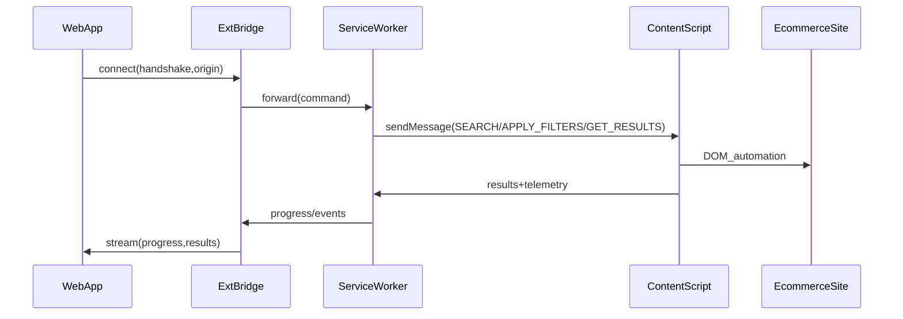

# Plan: Turn ai-retail-concierge into a functional web product powered by RetailAgent extension

## Goals

- Use the existing automation **code + architecture** from `/Users/arpan1.mukherjee/code/RetailAgent/` (MV3 extension) to power the UI prototype in `/Users/arpan1.mukherjee/code/ai-retail-concierge/`.
- Deliver a **website-only experience** where the user installs the extension; all automation happens in the user’s browser.
- Support **hybrid LLM**:
- **Local mode**: user brings their own API key (stored locally).
- **Backend mode**: optional Supabase Edge Functions for managed accounts (already scaffolded in `ai-retail-concierge/supabase/functions/*`).

## Test-driven development (TDD) plan

### Delivery rule: tests first

- Every behavior change must have a test (new or updated) written **before** implementation.
- A task is only “finished” when its required test cases are passing locally and in CI.

### Definition of Done (applies to every implementation task)

- Unit + integration tests green for the repo(s) touched.
- E2E smoke green for flows touched (fixture-based).
- No new lints.
- No secrets/PII in logs/events (redaction tests pass).

### Required test commands (must be green before marking any task complete)

These are the minimum commands we will standardize in the first TDD infra tasks:

- Web app (`/Users/arpan1.mukherjee/code/ai-retail-concierge/`)
- `npm run lint`
- `npm run test` (unit/integration)
- `npm run test:e2e` (Playwright smoke; fixture-based)
- Extension (`/Users/arpan1.mukherjee/code/RetailAgent/`)
- `npm test` (Jest unit/integration)
- `npm run test:bridge` (bridge-specific suite; can alias to `npm test`)
- `npm run test:e2e` (optional; if we wire Playwright to load extension from this repo directly)

No task that changes behavior should be marked complete unless the relevant commands are green.

### Test strategy (deterministic-first)

- **Primary**: fixture-driven tests (stable HTML fixtures representing Amazon/Flipkart DOM variants) to avoid flaky tests and ToS risk.
- **Secondary**: optional canary runs against real sites as manual/periodic checks (not required for “done”).
- LLM calls are **mocked** in tests; intent parsing validated via golden fixtures.

### Comprehensive test catalog (IDs)

#### Contract tests (shared)

- **T-CT-01**: `IntentV1` schema accepts valid examples; rejects invalid types.
- **T-CT-02**: `FilterV1` supports price/rating/brand/ram/storage/battery; rejects unknown keys unless under `extensions`.
- **T-CT-03**: `ProductV1` required fields: `id`, `title`, `price`, `url`, `platform`; optional enrichments allowed.
- **T-CT-04**: `ComparisonResultV1` winner must reference a candidate product.
- **T-CT-05**: Backward compatibility: old clients ignore unknown fields.
- **T-CT-06**: Forward compatibility: new optional fields don’t break parsers.

#### Extension bridge tests (RetailAgent)

- **T-EB-01**: Reject non-allowlisted origins (deny-by-default).
- **T-EB-02**: Accept allowlisted origins.
- **T-EB-03**: Reject protocolVersion mismatch.
- **T-EB-04**: Reject nonce replay.
- **T-EB-05**: Capability enforcement denies sensitive commands without consent.
- **T-EB-06**: Port disconnect cancels running job and emits terminal event.
- **T-EB-07**: Redaction: events/log payloads never include apiKey/address/payment details.

#### Service worker command tests (RetailAgent)

- **T-SW-01**: `parseIntent` returns structured intent from stubbed LLM response.
- **T-SW-02**: `parseIntent` falls back to simple parser on LLM failure.
- **T-SW-03**: `searchPlatforms` opens tab(s) and sends `SEARCH` command.
- **T-SW-04**: `searchPlatforms` handles content script timeout → fallback path.
- **T-SW-05**: `compare` produces deterministic winner for fixture inputs.
- **T-SW-06**: `openProduct` navigates to URL and emits `productOpened`.
- **T-SW-07**: `buyNow` stops at checkout boundary and emits `needsUserAction` for login/OTP.
- **T-SW-08**: Retry limits enforced (no infinite loops).
- **T-SW-09**: Cancellation stops further actions and closes/cleans up tabs (where configured).

#### LLM provider tests (RetailAgent)

- **T-LLM-01**: Provider selection works (Gemini/OpenAI/Anthropic) based on configured keys and user preference.
- **T-LLM-02**: Model listing works per provider (stubbed API responses).
- **T-LLM-03**: Model fallback works when a preferred model fails.
- **T-LLM-04**: Daily cache stores the chosen working model for a provider+key prefix and reuses it same day.
- **T-LLM-05**: Cache rotates next day (does not reuse yesterday’s cached model blindly).
- **T-LLM-06**: Redaction: logs/events never contain API keys or provider auth headers.

#### Content script / platform fixture tests (RetailAgent)

- **T-CS-AZ-01**: Amazon fixture: sponsored products are filtered out before extraction.
- **T-CS-AZ-02**: Amazon fixture: URL filter builder outputs expected `rh` for price/rating/battery/ram.
- **T-CS-FK-01**: Flipkart fixture: AJAX path continues without relying on PAGE_LOADED.
- **T-CS-FK-02**: Flipkart fixture: fallback search path continues to extraction/selecting.
- **T-CS-AJ-01**: Ajio fixture: product extraction returns valid `ProductV1` list.
- **T-CS-JM-01**: JioMart fixture: search + extraction works with expected selectors.
- **T-CS-RD-01**: RelianceDigital fixture: search + extraction works.
- **T-CS-TB-01**: TiraBeauty fixture: search + extraction works.
- **T-CS-BB-01**: BigBasket fixture: search + extraction works (including pincode/location gate simulation).
- **T-CS-BL-01**: Blinkit fixture: search + extraction works (including location gate simulation).
- **T-CS-ZP-01**: Zepto fixture: search + extraction works (including location gate simulation).

#### Web app tests (ai-retail-concierge)

- **T-WEB-01**: Extension not installed → show install CTA.
- **T-WEB-02**: Handshake success → UI enters connected state.
- **T-WEB-03**: Handshake failure → show actionable error + retry.
- **T-WEB-04**: Chat submit triggers parse/execute pipeline.
- **T-WEB-05**: Progress events stream into chat timeline.
- **T-WEB-06**: `productsFound` renders ProductPanel results.
- **T-WEB-07**: Manual select sends `openProduct` and transitions to checkout assist.
- **T-WEB-08**: Auto-purchase sends `buyNow` and renders step-by-step prompts.
- **T-WEB-09**: Cancellation resets loading state and emits UI confirmation.
- **T-WEB-10**: Offline shops: renders results and supports call/maps actions.
- **T-WEB-11**: No hard-coded catalog: product results come from extension events only (mocked extensionClient in tests).
- **T-WEB-12**: No hard-coded orders: order list is empty until extension/back-end provides real data; UI handles empty state.

#### Offline shops tests (Supabase + web)

- **T-OFF-01**: `local-shops` returns stable schema for query+location.
- **T-OFF-02**: Missing Places key uses mock fallback but maintains schema.
- **T-OFF-03**: Web UI handles empty results and API errors gracefully.

#### E2E smoke tests (Playwright harness, fixture-based)

- **T-E2E-01**: Web detects extension and completes handshake.
- **T-E2E-02**: Compare flow (fixtures): products displayed and winner highlighted.
- **T-E2E-03**: Manual select (fixtures): product opened and checkout-assist view reached.
- **T-E2E-04**: Auto-purchase (fixtures): reaches checkout boundary prompt.
- **T-E2E-05**: Mid-run disconnect: UI recovers into retryable state.
- **T-E2E-06**: Multi-platform compare (fixtures): N-platform comparison completes and closes losing tabs safely.

## Non-goals (for V1)

- Fully unattended checkout/payment completion (most sites require OTP/3DS and user confirmation).
- Scraping that violates platform ToS; design for “assistive automation” with explicit user initiation.

## Key discovery from current repos

- **RetailAgent** already has: service-worker orchestration, platform abstraction, content-script loaders, comparison logic, filter strategies, and robust error handling.
- **ai-retail-concierge** is a Vite/React UI prototype with demo flows (chat → products → checkout → tracking → local shops) in [`/Users/arpan1.mukherjee/code/ai-retail-concierge/src/pages/Index.tsx`](../ai-retail-concierge/src/pages/Index.tsx) and uses Supabase Edge Functions for mock product results in [`/Users/arpan1.mukherjee/code/ai-retail-concierge/supabase/functions/shopping-agent/index.ts`](../ai-retail-concierge/supabase/functions/shopping-agent/index.ts).

## Target architecture

### High-level flow

### Web↔Extension bridge (core enabler)

- Implement a secure protocol that allows the website to request actions from the extension.
- Use **MV3 externally_connectable** + message passing.
- Enforce **origin allowlist**, **capabilities**, and **user-gesture gating** (automation starts only after explicit user action).

## Workstreams

### 1) Product & UX alignment (website-first)

- Map UI screens in ai-retail-concierge to automation states in RetailAgent:
- Chat/intent → compare/search → results ranking → user pick or “auto pick” → open winning tab/product → assisted checkout → post-purchase actions → offline shop connect.

### 2) Shared contract (schemas + commands)

Define shared, versioned types used by both:

- `IntentV1`, `FilterV1`, `ProductV1`, `ComparisonResultV1`, `OrderV1`
- Commands: `parseIntent`, `searchPlatforms`, `compare`, `openProduct`, `buyNow`, `addToCart`, `trackOrder`, `initiateReturn`, `supportTicket`, `findLocalShops`
- Events: `log`, `progress`, `tabOpened`, `productsFound`, `comparisonReady`, `needsUserAction`, `completed`, `error`

### 3) Extension: expose automation as a capability API

Primary files to extend:

- `/Users/arpan1.mukherjee/code/RetailAgent/src/background/service_worker.js`
- `/Users/arpan1.mukherjee/code/RetailAgent/manifest.json`

Key changes:

- Add externally connectable configuration and origin allowlist.
- Add `WEBAPP_*` message handlers in service worker.
- Add job/session model so multiple web requests don’t collide.
- Stream structured events (progress/log/result) back to web app.

### 4) Web app: replace mock flows with extension-powered flows

Primary files to modify:

- `/Users/arpan1.mukherjee/code/ai-retail-concierge/src/components/ChatInterface.tsx`
- `/Users/arpan1.mukherjee/code/ai-retail-concierge/src/pages/Index.tsx`
- `/Users/arpan1.mukherjee/code/ai-retail-concierge/src/components/ProductPanel.tsx`
- `/Users/arpan1.mukherjee/code/ai-retail-concierge/src/components/CheckoutPanel.tsx`
- `/Users/arpan1.mukherjee/code/ai-retail-concierge/src/components/OrderTracker.tsx`
- `/Users/arpan1.mukherjee/code/ai-retail-concierge/src/components/LocalShopsPanel.tsx`

Key additions:

- Remove hard-coded/demo product catalogs and sample orders from the web app; treat the website as a UI that renders extension-driven search/compare/buy/track workflows.
- A small `extensionClient` module that:
- Detects extension installation
- Connects and handshakes
- Sends commands
- Subscribes to event stream
- Handles reconnect + timeouts

### 5) Hybrid LLM integration

- **Local mode**:
- Use RetailAgent’s LLM layer inside the extension for intent parsing and reasoning.
- Support multiple providers: **Gemini**, **OpenAI**, **Anthropic/Claude**.
- Before using a model, check **available models** for that provider/key and cache the best working model **per day** in browser storage.
- Website UI stores only UI preferences; API keys stored locally (prefer extension storage).
- **Backend mode**:
- Keep Supabase Edge Functions (e.g. `shopping-agent`) as a managed-intent + personalization service.
- Web app calls edge function to get `IntentV1` + personalization weights, then asks extension to execute.

### 6) Comparison engine & personalization

- Reuse RetailAgent’s product comparison scoring logic and expose it via the bridge.
- Add personalization weights from:
- UI settings (price vs rating vs delivery vs availability)
- Optional backend profile (hybrid mode)

### 7) Purchase journey (assistive automation)

- Support two modes:
- **Manual choose**: show comparison list; user chooses product; extension opens that product tab and assists checkout.
- **Auto choose**: extension selects best, opens product, proceeds until checkout boundary.

### 8) Post-purchase and offline store connect

- Post-purchase actions implemented via extension automation where possible.
- Offline store connect can stay backend-driven (Places API in edge function) while the web app orchestrates; extension can optionally open maps/call links.

### 9) Security, privacy, compliance

- Origin allowlist in extension.
- Signed/nonce handshake; per-session tokens.
- Permission prompts and clear UI around what the extension can do.
- Data minimization: store only what is required; sensitive info never leaves device in local mode.

### 10) Testing & release

- Unit tests for message contracts.
- Integration tests for web↔extension handshake.
- Playwright E2E for:
- search/compare flow
- manual select
- buy-now boundary
- error + retry

---

## Deliverables

- A working website (`ai-retail-concierge`) that uses the installed extension (`RetailAgent`) to:
- parse intents
- search Amazon/Flipkart
- compare results
- let the user choose or auto-pick